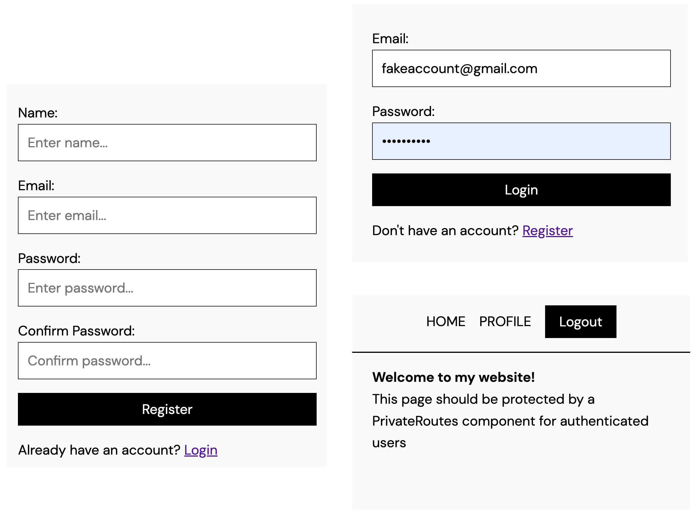

# React Authentication Private Routes With Appwrite

Source code for complete Authenticate tutorial (LINK WILL BE ADDED HERE). 

Reference [1-starter-template](1-starter-template) to follow along with video and [2-final](2-final) to see final source code.

Video guide can be found [here](video-notes.md)

**Topics coverd in video:**

- Private Routes
- Auth Context
- User Login
- Persisting logged in user
- User Logout
- Registration

### Project Pages

## Getting started

1. Clone repo
2. `cd 1-starter-template`
3. run `npm install`
4. Create account and project on appwrite.io and follow [guide](video-notes.md#appwrite-console-setup--config).